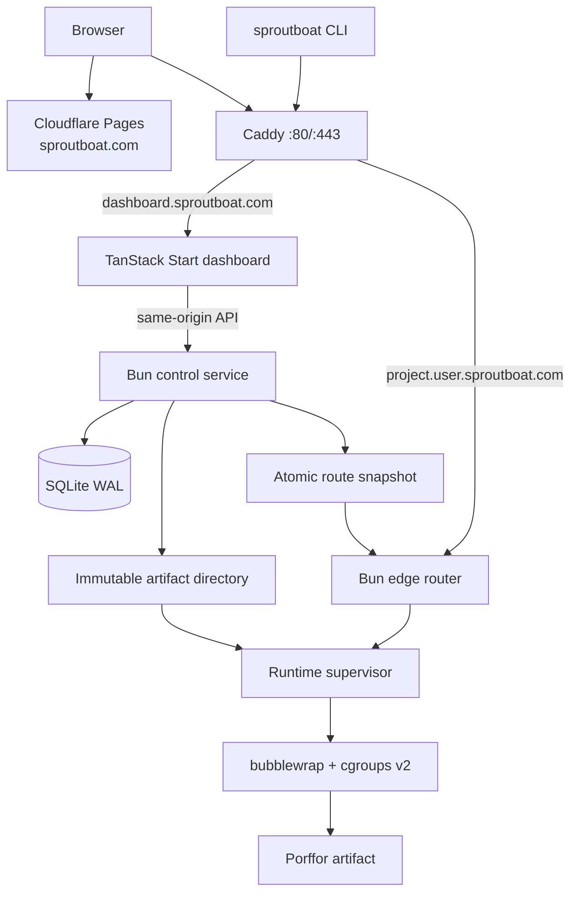

# Sproutboat POC — final implementation plan

Status: approved implementation plan, 2026-08-26.

This document is the handoff for the first working Sproutboat platform. It favors
one complete, honest vertical slice over breadth.

## 1. Product definition

Sproutboat is an experimental hosting platform for small JavaScript functions
compiled locally with [Porffor](https://porffor.dev/).

- `sproutboat.com` is the public website and documentation.
- `dashboard.sproutboat.com` is the authenticated dashboard, CLI login, and
  same-origin control API.
- `sproutboat` is the Wrangler-shaped CLI.
- `https://<project>.<username>.sproutboat.com` is the default deployment URL.
- Sproutboat is the product; Porffor is the compiler/runtime project it uses.

The initial promise is deliberately narrow:

> Build a supported JavaScript handler locally. Upload only the completed
> artifact. Deploy it to a stable HTTPS endpoint with logs, immutable versions,
> and rollback.

The platform must say plainly that it is experimental. Porffor is developing
quickly, the supported JavaScript and Web API surface is limited, and compiler
updates may introduce breaking changes. No Bun or Node fallback may hide a
Porffor incompatibility.

Current evidence is the repository compatibility report, not a marketing
claim: Porffor alpha 2 compiled all 30 frozen handlers, while 11 of 30 matched
Bun on all probes. The public site should derive any compatibility status from
versioned test data rather than hard-code a percentage.

## 2. POC scope

### Included

- GitHub sign-in at `dashboard.sproutboat.com`.
- One unique username namespace per account.
- Browser-based CLI authorization.
- Wrangler-like project initialization, local development, checks, builds,
  deployments, logs, versions, rollback, and deletion.
- Local Rolldown bundling and local Porffor compilation.
- Upload of a Linux x86-64 binary, manifest, and configuration only.
- One provider-neutral x86-64 Linux VPS.
- Generated `<project>.<username>.sproutboat.com` URLs with HTTPS.
- Immutable artifacts and atomic version activation.
- Runtime limits, sandboxed execution, bounded logs, backups, and an audit log.
- A small dashboard for projects, deployments, runtime status, and CLI setup.

### Explicitly excluded

- Remote source builds or source storage.
- Arbitrary JavaScript, npm, or Node compatibility promises.
- Outbound networking, WebSockets, cron, queues, KV, SQL, object storage, or
  Durable Object equivalents.
- Custom domains, teams, billing, public signup, Git deployments, preview
  environments, or multiple regions.
- Kubernetes, Redis, Kafka, a distributed database, or a central log stack.
- Automatic migration of existing deployments to a newer Porffor compiler.

## 3. User flow

1. The developer visits `sproutboat.com`, the static marketing and documentation
   site served by Cloudflare Pages, and sees the experimental status before
   signing in.
2. They sign in with GitHub and select an available lowercase username. This
   reserves `<username>.sproutboat.com` as their namespace.
3. They install the CLI and run `sproutboat login`, which opens the browser to
   approve a device-style authorization request.
4. The CLI stores the resulting user-owned credential locally; it can operate
   only on that account's projects. `SPROUTBOAT_TOKEN` remains an explicit
   override for CI and other non-interactive automation.
5. They run `sproutboat init hello`, write a supported handler, and use
   `sproutboat dev` locally.
6. `sproutboat deploy` bundles, checks, compiles, and smoke-tests locally. If any
   step fails, it sends no deployment request and uploads zero bytes.
7. After a successful local build, the CLI uploads only the artifact package.
8. The server validates and smoke-tests the artifact inside the production
   sandbox, activates it, and returns:
   `https://hello.<username>.sproutboat.com`.
9. The developer uses the CLI or dashboard to inspect versions and logs or to
   roll back.

The happy path should look like this:

```console
$ open https://dashboard.sproutboat.com
Create a user-owned CLI key
Logged in as andrea

$ sproutboat init hello
Created hello/sproutboat.jsonc
Created hello/src/index.js

$ cd hello
$ sproutboat deploy
Bundling with Rolldown...
Compiling with Porffor alpha 2...
Running compatibility checks...
Uploading artifact...
Activating version 01K4F9...

Deployed hello
https://hello.andrea.sproutboat.com
```

## 4. CLI contract

The binary and package are named `sproutboat`. Command names should match
Wrangler where the platform has a real equivalent.

### POC commands

| Command | Behavior |
| --- | --- |
| `sproutboat login` | Open browser authorization and securely save a scoped CLI credential locally |
| `sproutboat logout` | Revoke and remove the local token |
| `sproutboat whoami` | Show account, username namespace, and API endpoint |
| `sproutboat init [name]` | Create a starter handler and `sproutboat.jsonc` |
| `sproutboat dev [--port]` | Build and run locally with the production ABI |
| `sproutboat check` | Validate config, source surface, and local prerequisites |
| `sproutboat build` | Produce a deployable artifact without uploading |
| `sproutboat deploy` | Build locally, then upload and activate on success |
| `sproutboat deploy --dry-run` | Build and report sizes without uploading |
| `sproutboat deploy --artifact <path>` | Upload a previously built artifact |
| `sproutboat tail [--status]` | Stream bounded deployment logs |
| `sproutboat versions list` | List immutable versions |
| `sproutboat versions view <id>` | Show one manifest and deployment status |
| `sproutboat rollback [id]` | Atomically reactivate a stored version |
| `sproutboat delete` | Delete the project after explicit confirmation |

`secret`, custom-domain, storage, and environment commands are reserved for a
later phase. Do not ship placeholder commands that imply unsupported features.

### Configuration

`sproutboat.jsonc` is intentionally familiar:

```jsonc
{
  "$schema": "https://sproutboat.com/schema.json",
  "name": "hello",
  "main": "src/index.js",
  "compatibility_date": "2026-08-26",
  "vars": {
    "GREETING": "hello"
  }
}
```

The POC accepts plain, non-secret variables only. Configuration validation is
shared by the CLI and control API. A deployment records the resolved capability
profile and toolchain identity; the date never silently selects a new compiler
for an old deployment.

## 5. Local build and artifact contract

The server never receives source code. The default build uses a versioned local
OCI image so every developer produces the server target consistently:

```text
ghcr.io/sproutboat/build:<toolchain-id>
target: linux/amd64
network: disabled
source mount: read-only
output mount: writable
```

On macOS, Windows, or ARM, Docker or Podman supplies the Linux x86-64 build
environment. Native Linux x86-64 builds may be added as an optimization only
when they produce the same manifest and behavior.

`sproutboat build` performs:

1. Parse and validate `sproutboat.jsonc`.
2. Bundle the entry point with pinned Rolldown.
3. Add the versioned Sproutboat runtime shim.
4. Reject syntax and APIs outside `http-sync-v0`.
5. Compile with the pinned Porffor source identity.
6. Run fixed compatibility probes and the artifact smoke test.
7. Write `.sproutboat/dist/<artifact-id>/manifest.json` and `worker`.

The manifest contains:

```json
{
  "schemaVersion": 1,
  "project": "hello",
  "target": "linux-x86_64",
  "abi": "abi-v1",
  "capabilityProfile": "http-sync-v0",
  "porfforVersion": "exact release and source identity",
  "rolldownVersion": "exact version",
  "buildImage": "immutable image digest",
  "sourceHash": "sha256:...",
  "binaryHash": "sha256:...",
  "binarySize": 0,
  "builtAt": "ISO-8601 timestamp"
}
```

The upload package contains only `manifest.json` and `worker`. It excludes the
bundle, source, source maps, local environment files, tests, and VCS metadata.

Client output cannot be trusted: callers can bypass the CLI or modify the
binary. The server therefore treats every upload as an arbitrary hostile native
executable. A platform signature means “accepted and validated by this
platform,” not “proved to have been generated by Porffor.”

## 6. Single-server architecture

Deploy a modular monolith to one ordinary VPS from any provider. Logical
boundaries are separate processes and packages, but they share one machine
initially.



### Technology choices

| Area | POC choice |
| --- | --- |
| Language/runtime | TypeScript on Bun |
| Marketing site | Static site on Cloudflare Pages |
| Dashboard UI | React 19 and TanStack Start with SSR; developer and operator surfaces |
| Control HTTP server | `Bun.serve` and Web `Request`/`Response` APIs |
| Authentication | Better Auth, GitHub OAuth only, SQLite sessions |
| Database | `bun:sqlite`, WAL mode, explicit SQL migrations |
| CLI | TypeScript, shipped as standalone Bun executables and via `bunx` |
| Local bundler | Rolldown, version pinned in the build image |
| Compiler | Exact Porffor release/source identity pinned in the build image |
| TLS/reverse proxy | Caddy |
| Artifact storage | Content-addressed local filesystem |
| Runtime isolation | bubblewrap, unprivileged users, cgroups v2, seccomp |
| Service management | systemd |
| Provisioning | Provider-neutral Ansible roles and inventory |
| Backups | Restic to a small off-server S3-compatible bucket |
| Tests | Bun test, CLI/API integration tests, browser smoke tests |

Do not place the runtime supervisor inside a general Docker Compose stack. It
needs explicit host access to namespaces and cgroups. Caddy, control, and edge
run as locked-down systemd services.

### Host routing and TLS

- `sproutboat.com` and `www.sproutboat.com` are Cloudflare Pages custom domains. They
  serve only public, static marketing and documentation content.
- `dashboard.sproutboat.com` points directly to the VPS and is served by Caddy.
  Caddy serves the React dashboard and forwards same-origin `/api` and `/v1`
  requests to the authenticated Control service.
- A wildcard DNS record for `*.sproutboat.com` points to the VPS for deployment
  hosts. The exact dashboard record takes precedence over the wildcard.
- Keep the dashboard and wildcard records DNS-only. Caddy uses Cloudflare
  DNS-01 validation to issue the exact TLS certificates required for nested
  deployment names. Cloudflare's proxy and Universal SSL remain appropriate
  for the Pages marketing site, but not for the deployment wildcard.
- Caddy obtains exact certificates for nested deployment hosts through a
  Cloudflare DNS-01 challenge.
- On-demand certificate issuance must use an internal `ask` endpoint that
  returns success only for an active route. This prevents arbitrary certificate
  requests against the platform's ACME limits.
- `sproutboat.com` serves user code and receives no dashboard/session cookies.
- Better Auth cookies are secure, HTTP-only, SameSite, and host-scoped to
  `dashboard.sproutboat.com`; cross-subdomain cookies are disabled.
- Add `sproutboat.com` to the Public Suffix List before public multi-tenant launch.

### Control plane

The control service owns:

- Website and dashboard delivery.
- GitHub authentication and invitations.
- Username reservation.
- CLI authorization and token revocation.
- Project, version, route, and audit metadata.
- Artifact upload and validation orchestration.
- Atomic activation and rollback.
- Log and status APIs.

It must not be consulted on the request-serving hot path. The edge router loads
an atomic snapshot such as:

```text
hostname -> project id -> active version -> local artifact path
```

Already active deployments continue serving if the control service or SQLite
is temporarily unavailable.

### Runtime request path

1. Caddy terminates TLS and forwards the deployment hostname to the edge
   router.
2. The router resolves the active artifact from its in-memory snapshot.
3. The supervisor starts the artifact inside the sandbox.
4. For `abi-v1`, the router sends one bounded framed request over stdin and
   reads one bounded framed response from stdout.
5. The supervisor enforces the deadline, memory, CPU, process, body, response,
   and log limits.
6. The router returns the response and writes a structured outcome record.

Start with one process per request for correctness. A small warm pool is a
later measured optimization, not a POC promise.

## 7. Authentication and CLI authorization

The POC uses GitHub OAuth only. Better Auth manages the website OAuth account,
secure session, CSRF protection, rate limiting, and user-owned API keys. Sproutboat
adds a unique namespace selection after the first login.

The POC uses a short-lived device-style flow for `sproutboat login`:

1. CLI creates an authorization request with a high-entropy verifier.
2. API returns a secret device code, short user code, browser URL, polling
   interval, and expiry.
3. CLI opens `https://dashboard.sproutboat.com/cli/authorize?code=...` and polls a token
   endpoint with the secret device code in the request body, never the URL.
4. The website requires a valid GitHub-backed session and displays the exact
   requested CLI scopes.
5. On approval, the API returns a token once; only its hash is stored.
6. The CLI stores the token in the OS credential store. A permission-`0600`
   config-file fallback must be explicit.

Initial token scopes are `projects:read`, `deployments:write`, `logs:read`, and
`tokens:self-revoke`. Tokens have a visible last-used time and can be revoked
from the dashboard.

## 8. Data model

Use SQLite foreign keys, migrations, UTC timestamps, and opaque IDs.

| Table | Essential fields |
| --- | --- |
| Better Auth tables | User, account, session, verification data |
| `profiles` | user id, unique username slug, created time |
| `cli_authorizations` | user code hash, verifier hash, scopes, state, expiry |
| `api_tokens` | user id, token hash, scopes, last used, revoked time |
| `projects` | owner id, unique owner/name pair, active deployment id |
| `deployments` | project id, artifact id, manifest JSON, state, timestamps |
| `artifacts` | content hash, path, size, platform signature, ref count |
| `routes` | hostname, project id, active deployment id |
| `nodes` | name, role, region, architecture, identity, health, last seen |
| `audit_events` | actor, action, target, safe metadata, timestamp |

Request logs remain in size-bounded rotated files for the POC. SQLite stores
deployment summaries, not every request body or log line.

Username and project slugs are 3–32 lowercase ASCII characters, digits, and
single hyphens. They cannot begin or end with a hyphen. Reserve names including
`www`, `api`, `admin`, `status`, `docs`, `support`, and `cli`.

## 9. Control API

All endpoints are versioned under `/v1`. Browser endpoints use the website
session; CLI endpoints use scoped bearer tokens.

```text
POST   /v1/cli/authorizations
POST   /v1/cli/authorizations/token
POST   /v1/cli/authorizations/:userCode/approve
DELETE /v1/tokens/current

GET    /v1/me
POST   /v1/projects
GET    /v1/projects
GET    /v1/projects/:name
DELETE /v1/projects/:name

POST   /v1/projects/:name/deployments
GET    /v1/projects/:name/deployments
GET    /v1/projects/:name/deployments/:id
POST   /v1/projects/:name/deployments/:id/activate
GET    /v1/projects/:name/logs/stream

GET    /internal/tls/allow?domain=...
GET    /internal/health
```

Artifact upload is bounded multipart data. The server validates the archive,
hashes, ELF target, ABI/profile allowlist, executable dependencies, and project
authorization before a sandbox smoke probe. Activation happens only after all
checks pass.

Deployment states are:

```text
uploaded -> validating -> verified -> activating -> active
        \-> rejected
        \-> invalid_artifact
        \-> incompatible
```

There is no server-side `building` state. Rollback reactivates an already
validated artifact without compilation or upload.

## 10. Runtime security gate

Native artifacts are hostile input. Before inviting anyone outside the core
team, execution must have:

- A dedicated unprivileged identity or user namespace.
- Read-only artifact mount and empty ephemeral writable directory.
- No host filesystem visibility.
- No network interface for `http-sync-v0`.
- PID, mount, IPC, UTS, and network namespaces.
- `no_new_privs`, dropped Linux capabilities, and a traced seccomp allowlist.
- cgroups v2 limits for CPU, memory, process count, and I/O.
- Hard wall-clock timeout and guaranteed descendant cleanup.
- Bounded request, response, header, environment, and log sizes.
- No secrets in argv or inherited host environment.
- Validation and smoke probes executed inside the same boundary.

The platform signature, route snapshot, and artifact hashes are verified before
every activation. A failed rollout cannot replace the previously active route.

## 11. Website and dashboard

### Visual direction

The interface should feel familiar to a Cloudflare user without copying
Cloudflare's assets or page composition: calm infrastructure UI, warm neutral
surfaces, compact navigation, thin borders, clear status labels, monospace for
commands, and restrained decoration.

Orange is the Sproutboat deployment signal, with blue reserved for routes and telemetry. It is a hint,
not a purple wash:

- Use purple for the single primary action, links, focus rings, selected
  navigation, and small brand moments.
- Keep headings and ordinary body copy neutral.
- Use semantic green, amber, and red only for success, warning, and failure.
- Avoid gradients, glowing cards, giant illustrations, and several filled
  purple actions competing in one view.

Starting light-theme tokens, to be contrast- and gamut-verified in the browser:

```css
:root {
  --bg: oklch(0.982 0.004 290);
  --surface: oklch(1 0 0);
  --surface-subtle: oklch(0.965 0.008 290);
  --text: oklch(0.220 0.018 285);
  --text-muted: oklch(0.500 0.020 285);
  --border: oklch(0.900 0.012 290);
  --accent: oklch(0.520 0.200 302);
  --accent-hover: oklch(0.460 0.190 302);
  --accent-soft: oklch(0.950 0.035 302);
}
```

Define semantic tokens rather than using raw palette values in components.
Provide tuned dark and increased-contrast variants before calling the theme
complete. Verify normal text, muted text, links, buttons, focus rings, badges,
and code blocks in every appearance.

### Public homepage

Reading order:

1. Persistent experimental banner.
2. Compact header: Sproutboat, Product, Current support, GitHub, Sign in.
3. Hero with one primary action and one descriptive secondary link.
4. Three-step flow: build locally, upload the artifact, deploy to HTTPS.
5. Terminal example showing `sproutboat deploy` and the resulting URL.
6. Current runtime card generated from compatibility data.
7. Honest limitations and breaking-change section.
8. Footer crediting and linking to the Porffor compiler project.

Use a centered content measure, generous section spacing, shared leading edges,
and responsive cards that collapse only when their content stops fitting. On
mobile, keep text and controls inset while section backgrounds may bleed.

Recommended homepage copy:

**Persistent banner**

> Experimental alpha — Sproutboat uses the rapidly evolving Porffor compiler.
> Supported APIs are limited, and updates may include breaking changes.

**Hero**

> JavaScript functions, compiled before they reach the server.

> Sproutboat is an experimental hosting platform powered by Porffor. Build
> locally, upload only successful artifacts, and deploy to your own
> `sproutboat.com` URL.

Primary action: `Sign in with GitHub`

Secondary link: `Read the current limitations`

**Limitations heading**

> Built in public, changing quickly

> Porffor is under active development. Some JavaScript and Web APIs are not
> available yet, and a new compiler release may require you to rebuild a
> deployment. Sproutboat pins every deployed artifact so an update never silently
> changes code already running.

**Footer note**

> Sproutboat is an independent experiment built with the Porffor compiler.

### Dashboard pages

- `/dashboard`: namespace, experimental/runtime notice, projects, recent
  deployments, and CLI quick start.
- `/dashboard/projects/:name`: live URL, active version, deployment history,
  bounded recent logs, rollback, and delete.
- `/dashboard/tokens`: CLI tokens with scopes, last used time, and revoke.
- `/cli/authorize`: user code, requested scopes, expiry, `Authorize CLI`, and
  `Cancel`.

Use sentence case throughout. Buttons must name their action: `Create project`,
`Authorize CLI`, `Roll back to this version`, `Revoke token`, and
`Delete project`. Empty states should explain the next command rather than stop
at “No projects.”

The experimental notice remains visible in the dashboard header. It must not
be dismissible during the POC.

## 12. Repository structure

```text
apps/
  web/                 TanStack Start developer dashboard and operator console
  control/             Bun API, auth, database, artifact validation
  cli/                 sproutboat CLI
services/
  edge/                hostname router and route snapshot loader
  supervisor/          sandbox lifecycle and ABI bridge
packages/
  artifact/            manifest schema, hashing, archive validation
  config/              sproutboat.jsonc parser and schema
  protocol/            control, edge, and runtime ABI types
  ui/                  shared accessible UI primitives and tokens
  test-fixtures/       accepted, rejected, timeout, and abuse artifacts
build-image/            pinned local Linux build environment
infra/
  ansible/             VPS provisioning and systemd units
  inventory.example.yml Provider-neutral server inventory template
  caddy/               routing and on-demand TLS configuration
  backup/              restic configuration and restore runbook
docs/
  runtime-abi-v1.md
  artifact-v1.md
  capability-http-sync-v0.md
  operations.md
```

Keep package boundaries real: the control service must talk to the supervisor
through the versioned protocol package rather than importing supervisor
internals.

## 13. Scaling preparation

Prepare for multiple servers through interfaces, not infrastructure:

- Content-address every artifact and never mutate it.
- Keep the edge request path independent from SQLite and the control service.
- Write route snapshots atomically and version their schema.
- Put artifact persistence behind a filesystem/object-store interface.
- Put desired-state reconciliation behind a control/edge protocol.
- Give every enrolled server a role, region, revocable identity, and health
  record independent of its hosting provider.
- Record target architecture and ABI on every artifact.
- Keep deployment IDs globally unique.

The first scale step is to move only the edge router, supervisor, and artifact
cache to a second server. The control plane remains on the original node. Edge
nodes pull signed artifacts and snapshots; the control plane never pushes shell
commands.

Move artifacts to S3-compatible storage when the second node exists. Consider
PostgreSQL only if the control plane itself needs multiple writers or replicas.
Do not introduce Kubernetes or a queue merely to prepare for hypothetical load.

## 14. Provider-neutral server operations

Sproutboat must not depend on a VPS vendor. A server is eligible when it provides:

- x86-64 CPU for the first artifact target.
- A supported Debian-stable or Ubuntu-LTS installation with systemd.
- cgroups v2, user namespaces, and the required sandbox kernel features.
- Root or passwordless-sudo SSH access during provisioning.
- A stable public IPv4 or IPv6 address and inbound ports 80/443.
- Enough local disk for the OS, immutable artifacts, and bounded logs.

The Ansible inventory assigns one of three roles:

```yaml
all:
  hosts:
    poc-1:
      ansible_host: 203.0.113.10
      ansible_user: root
      sproutboat_role: all-in-one
      sproutboat_region: eu-central
```

- `all-in-one`: control, Caddy, edge, supervisor, SQLite, and artifact store.
- `control`: website, API, database, and desired state.
- `edge`: Caddy/ingress where applicable, route cache, artifact cache, and
  supervisor.

The first machine uses `all-in-one`. Adding a later server means creating or
renting any compatible machine, adding its inventory entry, and applying the
same role. No provider SDK belongs in the application runtime.

Provisioning must run a preflight check before changing the host: distribution,
architecture, systemd, cgroups v2, namespace support, free disk, required ports,
and clock synchronization. An unsupported machine fails with an actionable
report.

For a future `edge` node, provisioning creates a one-time enrollment request.
The control plane records the node identity, exchanges long-lived mutually
authenticated credentials, and then permits it to pull signed desired state and
artifacts. Enrollment is explicit and revocable; knowing the API URL is never
enough to join the fleet.

Common operating requirements:

- Public ports: 80 and 443 where the assigned role serves traffic.
- SSH: key-only, operator IP restriction where practical.
- Services: Caddy, control, edge, and supervisor under separate systemd units.
- Separate Unix users and restrictive filesystem ownership per service.
- SQLite and artifact directories backed up off-server with Restic.
- Daily backup, retention limits, and a documented restore drill.
- journald and artifact retention capped by bytes.
- Health checks distinguish Caddy, control, edge, disk pressure, and ability to
  execute a canary artifact.
- Existing routes and artifacts must survive a control-service restart and a
  full machine reboot.

## 15. Terra implementation sequence

Terra should implement these phases in order. Each phase ends with working
tests and documentation; later phases must not compensate for unfinished
earlier contracts.

### Phase A — Freeze contracts

1. Create the monorepo layout and shared TypeScript configuration.
2. Write `artifact-v1`, `abi-v1`, `http-sync-v0`, and `sproutboat.jsonc` schemas.
3. Define the provider-neutral server inventory and node-enrollment contract.
4. Turn the existing passing corpus into the first accepted capability suite at
   `tests/porffor/capabilities/`.
5. Add explicit rejected fixtures for unsupported syntax and APIs.

Exit: schemas parse valid fixtures and reject invalid fixtures deterministically.

### Phase B — Local build and CLI core

1. Create the pinned Linux x86-64 build image.
2. Implement `init`, `check`, `build`, `dev`, and `deploy --dry-run`.
3. Produce manifest-plus-binary artifacts with verified hashes.
4. Prove a failed build makes no network request.

Exit: macOS and Linux can produce the same target artifact format, and no
source appears in the output package.

### Phase C — Local runtime vertical slice

1. Implement the framed ABI bridge and supervisor.
2. Add time, size, process, memory, filesystem, and network restrictions.
3. Put two artifacts behind the hostname router using an atomic snapshot.
4. Add response, crash, timeout, and cleanup tests.

Exit: two local hostnames route correctly, and hostile fixtures cannot escape
their limits.

### Phase D — Control plane and authentication

1. Add SQLite migrations and Better Auth GitHub OAuth.
2. Add public GitHub sign-in, username reservation, CLI authorization, and scoped
   token storage.
3. Implement projects, artifact-only deployments, validation, activation,
   versions, rollback, deletion, audit events, and log streaming.
4. Verify that no API endpoint accepts source fields or source archives.

Exit: the complete API flow works locally using a real CLI token.

### Phase E — Website and dashboard

1. Implement the semantic color tokens and shared UI primitives.
2. Build the homepage with permanent experimental messaging and honest current
   support data.
3. Build sign-in, namespace selection, CLI approval, project list, project
   detail, version, log, rollback, delete, and token screens.
4. Test narrow and wide layouts, keyboard flow, focus visibility, screen-reader
   names, light/dark appearance, increased contrast, and long text.

Exit: a new developer can understand the experiment and authorize the
CLI without operator explanation.

### Phase F — CLI deployment operations

1. Implement `login`, `logout`, `whoami`, `deploy`, `tail`, `versions`,
   `rollback`, and `delete` against the control API.
2. Make output and errors concise, actionable, and stable for scripting.
3. Handle interruption, expired authorization, rejected artifacts, activation
   failure, and rollback cleanly.

Exit: the full CLI happy path and failure paths pass integration tests.

### Phase G — One-server deployment

1. Provision a compatible VPS from any provider, including systemd services,
   firewall, directories, backups, and health checks with Ansible.
2. Configure DNS and Caddy for all three domains and guarded certificate
   issuance.
3. Deploy the control and execution services.
4. Complete a backup restore, reboot, rollback, timeout, and disk-pressure drill.
5. Run the same preflight and base role against a second clean compatible VM to
   prove there are no dependencies on the first VPS provider.

Exit: a developer can go from website login to a live HTTPS deployment
without shell access to the server.

## 16. POC acceptance test

The POC is complete only when all of the following are demonstrated:

1. Visit `sproutboat.com`, see the experimental warning, then sign in with GitHub
   at `dashboard.sproutboat.com` and
   reserve `andrea`.
2. Run `sproutboat login` and approve the exact scopes in the browser.
3. Run `sproutboat init hello` and deploy a passing handler.
4. Receive and successfully request
   `https://hello.andrea.sproutboat.com` over valid HTTPS.
5. Introduce a compile error and prove `sproutboat deploy` uploads zero bytes.
6. Inspect logs with `sproutboat tail`.
7. Deploy a second version and roll back to the first without rebuilding.
8. Restart the control service and confirm the deployment still serves.
9. Reboot the VPS and confirm routes and active versions recover.
10. Reject wrong-architecture, oversized, modified, unsupported, crashing, and
    timing-out artifacts without replacing the active version.
11. Restore SQLite and artifacts from the off-server backup.
12. Pass the website keyboard, contrast, responsive-layout, and copy checks.

## 17. Rules against scope creep

- Do not build a remote builder; uploads are artifacts only.
- Do not add unsupported Wrangler commands for visual parity.
- Do not add public signup before the runtime security gate passes.
- Do not add custom domains, billing, or storage bindings before the POC
  acceptance test passes.
- Do not add another server until traffic, latency, or availability data gives
  a concrete reason, but keep server enrollment independent of the provider.
- Do not hide Porffor failures behind Bun, Node, or another runtime.
- Do not describe the product as production-ready or generally Workers-
  compatible while it is experimental.

The next decision after the POC is evidence-based: keep one server, add a
second execution region, or pause platform work while Porffor compatibility
improves. The infrastructure is intentionally shaped so all three outcomes are
cheap.
