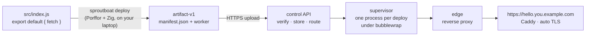

<div align="center">

# 🌱 Sproutboat

**Compile a JavaScript function to a native binary on your laptop.
Ship the binary. The server never sees your code.**

Workers-style HTTP handlers, hosted on **one Linux VPS you control** — stable
HTTPS, immutable versions, instant rollback, live logs. No Docker, no build
servers, no vendor.

[](LICENSE)
[](COMPAT.md)
[](infra/README.md)

</div>

---

## The idea

Your handler is compiled **locally** with [Porffor](https://porffor.dev/) (+ Zig
cross-compile) into a single `linux-x86_64` executable. What you upload is an
**artifact** — `manifest.json` plus one `worker` binary — and nothing else. No
source, no `node_modules`, no bundler config leaves your machine.



The server's job is narrow: **verify, store, route, and run** immutable
artifacts in a sandbox. It never builds anything.

## What's in this repo

The **single-machine, single-admin** deployment:

| Piece | Path | Role |
|---|---|---|
| **Control API** | `apps/control` | Auth, projects, artifact intake + verification, routes, backups. Artifact-only — no source ever. |
| **Edge** | `services/edge` | Public request path. Reverse-proxies each route to its running worker; records metrics + logs. |
| **Supervisor** | `services/supervisor` | One long-lived native worker process per deployment, under `bubblewrap`. Restarts on exit. No per-request spawn. |
| **Dashboard** | `apps/web` | React SPA Caddy serves from disk. Metrics, versions, users, backups. |
| **Installer** | `install.sh` | The whole runbook: user namespaces, Caddy + bubblewrap, default-deny firewall, systemd units, one admin identity. |

The **CLI is its own MIT repo** —
[`baronunread/sproutboat-cli`](https://github.com/baronunread/sproutboat-cli).
It does the Porffor build and targets any control plane.

> ⚠️ **Experimental proof of concept.** Not production-ready, not generally
> Workers-compatible. Managed cloud hosting is coming; the CLI already works
> against a hosted control plane, so nothing changes for you when it opens.

## Deploy to a VPS

SSH into a fresh Linux box — Debian/Ubuntu or RHEL-family, x86-64 — and:

```sh
curl -fsSL https://raw.githubusercontent.com/baronunread/sproutboat/main/install.sh | sudo bash
#  …or, from a checkout:  sudo ./install.sh
```

It asks 3–4 questions (domain, ACME email, admin name), then runs unattended:
unprivileged user namespaces, Caddy + bubblewrap, a default-deny firewall
(22/80/443 only), the dashboard build, one admin identity, and the systemd
services. It pauses **once** for you to add a single wildcard DNS record and
waits for it to resolve.

```
Type:  A       Name:  *.example.com   (literally  *  )
Value: <your box's public IPv4>       Proxy: OFF / DNS only
```

That one record covers `control.`, `dashboard.`, and every
`<project>.<admin>.example.com` deployment. Per-hostname certs via
HTTP-01 / TLS-ALPN-01 — **no DNS API token, no wildcard cert**. Full runbook:
[`infra/README.md`](infra/README.md).

Non-interactive: set `SB_DOMAIN`, `SB_ACME_EMAIL`, `SB_ADMIN`. GitHub sign-in is
opt-in via `SB_GITHUB_CLIENT_ID` + `SB_GITHUB_CLIENT_SECRET`.

## Ship your first function

```sh
bunx sproutboat init hello
bunx sproutboat login --api-url https://control.example.com
bunx sproutboat deploy
```

A handler is a Cloudflare-style default export:

```js
// hello/src/index.js
export default {
  fetch(request) {
    const name = new URL(request.url).searchParams.get("name");
    return new Response(name ? `${env.GREETING}, ${name}` : env.GREETING);
  }
};
```

```jsonc
// hello/sproutboat.jsonc
{
  "name": "hello",
  "main": "src/index.js",
  "compatibility_date": "2026-08-26",
  "vars": { "GREETING": "hello from Sproutboat" }
}
```

`env.*` carries your `vars` (baked into the artifact) and any project
**secrets**, which are encrypted at rest with AES-256-GCM and never sit in the
uploaded binary. Also on the CLI: `build`, `deploy --dry-run`,
`deploy --artifact`, `tail`, `versions list`, `rollback`, `delete --yes`.

**Immutable by construction.** Every deploy is a new content-addressed version.
Rollback re-points the route — it never rebuilds. A compile error uploads
**zero bytes** and leaves the live version untouched.

## The runtime

Porffor `alpha-4` compiles `export default { fetch }` into a
[µWebSockets](https://github.com/uNetworking/uWebSockets) server binary
(~0.42 MB). The supervisor gives it a loopback port, starts it, waits for
`listen`, and restarts it if it exits — flat RSS verified over 500k requests, so
no recycle. On Linux every worker runs under `bubblewrap` (`sprout-sandbox.sh`):
loopback only, no outbound network, read-only filesystem, own UID, and a
per-sprout cgroup scope for memory / CPU / pids caps.

## Dashboard & accounts

`https://dashboard.<domain>` — a static SPA, no service, no port.

- **Sign in** with email + password, or GitHub (if configured). The admin's
  email is the ACME email; the admin's password is the token in
  `/root/sproutboat-admin.env` (same token the CLI uses).
- **No self-service sign-up.** `POST /api/auth/sign-up` always returns 403. The
  admin creates every other account from **Admin → Users**; those users then
  sign in with email + password or link GitHub to the same address.

## Local end-to-end

Runs the whole stack — Portless, a GitHub emulator, Control, Edge, and the
dashboard — on `*.sproutboat.localhost`.

```sh
bun install
bun run dev:local
```

Trust Portless's local CA on first run, open
`https://dashboard.sproutboat.localhost/`, sign in as the seeded `andrea`
account, reserve the `andrea` namespace, then in another terminal:

```sh
bunx sproutboat init hello
bunx sproutboat login --api-url https://control.sproutboat.localhost
# approve in the dashboard, then:
bunx sproutboat deploy
open https://hello.andrea.sproutboat.localhost
```

Reset: `Ctrl-C`, then `rm -rf .local/sproutboat ~/.config/sproutboat` and
restart. Portless certs survive.

## Compatibility harness

One question: **does the installed Porffor run enough real webhook-style
handlers to justify the supported capability profile?** The kill threshold is
40% of capability handlers matching Bun on all three probes — compilation alone
doesn't count, behavior must match.

```sh
bun add --dev porffor@latest && bun run retest   # rebuilds report.json + COMPAT.md
```

`COMPAT.md` starts with the compiler version, compile/match counts, median
binary size, and a **GO / NO-GO** decision, then groups failures into
*compile* / *runtime* / *output mismatch*. To test an unpublished compiler:

```sh
PORFFOR_BIN=/path/to/porf PORFFOR_VERSION='alpha 2 (…)' PORFFOR_MODE=native-fetch bun run retest
```

Current: **Porffor alpha-4 — 31/31 compile, 29/31 match** (the two misses are
`Date` parsing). See [`COMPAT.md`](COMPAT.md).

## Repository map

```
apps/control       control API — auth, projects, artifacts, routes, backups
apps/web           React dashboard (Vite + TanStack Router)
services/edge      public request path, metrics, logs
services/supervisor  sandboxed per-deploy worker processes
install.sh         single-VPS provisioner  ·  infra/  systemd units + runbook
tools/             compat harness (refserve, compile, diff, report) + dev-local
tests/porffor/capabilities/   the 31-handler Porffor capability suite
docs/              artifact-v1, bindings-v1, self-hosted-v1, runtime, metrics
```

## Handy scripts

```sh
bun run dev:local     # full local stack
bun test              # apps/ services/ tests/
bun run typecheck     # tsc --noEmit
bun run lint          # oxlint (+ anti-slop plugin)
bun run check         # validate tools + capability-suite shape + Bun probes
bun run retest        # typecheck + test + check + diff + report
```

Use **Bun**, not npm, in this repo.

## Roadmap

Bindings v1 landed: an artifact that ships a `bindings.json` gets a **broker
sidecar** (from `sproutboat/runtime/broker`) on a token-gated port, giving
handlers a host-implemented `env` surface plus cron/queue triggers.
[`docs/bindings-v1.md`](docs/bindings-v1.md) is the original design sketch.
More Workers-parity bindings — D1, R2 multipart, Cache API, Durable Objects,
Service bindings, `ctx.waitUntil`, WebSockets, push-to-deploy — are tracked in
[issues](https://github.com/baronunread/sproutboat/issues). Scale beyond one
box is deliberately deferred until traffic data asks for it.

## License

[MIT](LICENSE) © 2026 Andrea Bruno
